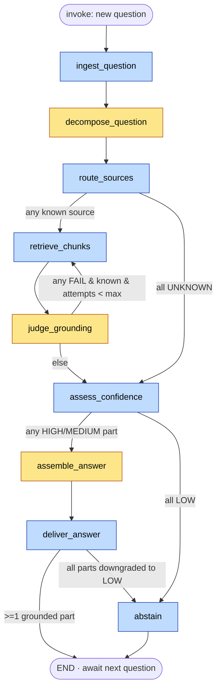

# Grounded Documentation Q&A for the Plant Floor

A multi-agent RAG system that answers a floor supervisor's multi-part questions from the
right plant documentation — **safety procedures, maintenance manuals, quality-control standards** —
with a citation on every claim, a computed confidence level, and an **honest abstain** on anything
it can't ground. It never guesses.

The design principle throughout: **LLMs read, judge, and draft; deterministic code decides.**
Every step that has to be correct, auditable, or defensible (routing, confidence, citation
enforcement, the decision to abstain) is plain Python you can read top-to-bottom — not a model's
self-report. Built with LangGraph + Pydantic v2, models served via OpenRouter.

---

## The problem

A floor supervisor asks something like *"What torque do the CNC VF-4 vise-jaw bolts need, and
what's the spindle warranty period?"* — often multi-part, often spanning two different manuals.
The wrong answer on a torque spec or a lockout step is a safety and quality failure, not a
typo. So the bar isn't "sounds plausible," it's:

- **Grounded** — every delivered claim traces to a specific chunk of a specific document version.
- **Cited** — ≥1 citation per delivered part, enforced in code.
- **Honest** — parts it can't ground are flagged as uncertain or abstained, never fabricated.

**Primary KPI:** % straight-through (fully grounded, cited, HIGH-confidence answers, no uncertainty flag).
**Counterweight (the one that actually matters):** zero ungrounded claims ever delivered.

---

## Architecture at a glance

Nine nodes in a single-conversation LangGraph pipeline. Three are LLM agents; six are deterministic.
The colour of each node is the whole story — it's the answer to "is this fair / auditable / safe."



### The agency line

| Node | Job | Agency | Reads → Writes |
|---|---|---|---|
| `ingest_question` | open a turn for the new question | **deterministic** | `question_text` → `current_turn(RECEIVED)` |
| `decompose_question` | split a multi-part question into standalone, single-source sub-questions | **LLM** (cheap) | `question_text` + history → `sub_questions[]` |
| `route_sources` | validate each proposed source against the known-source enum; set the retrieval filter | **deterministic** | `proposed_source` → `routed_source` |
| `retrieve_chunks` | hybrid (dense + BM25) top-k search per known-source sub-question | **deterministic** | `text, routed_source` → `retrieved[]` |
| `judge_grounding` | per sub-question, decide if the chunks actually support an answer; for tables, verify the asked-for value is present | **LLM** (capable) | `retrieved[]` → `verdict, supporting_chunk_ids` |
| `assess_confidence` | compute HIGH / MEDIUM / LOW from signals the model can't fake; record knowledge gaps | **deterministic** | judge verdict + score + coverage → `confidence` |
| `assemble_answer` | draft a cited answer for HIGH/MEDIUM parts only, from the supporting chunks | **LLM** (mid) | supporting chunks → `answer_text, citations[]` |
| `deliver_answer` | enforce ≥1 citation per part; stitch deterministic uncertainty lines for LOW parts | **deterministic** | fragments → final answer (`ANSWERED` / `ANSWERED_PARTIAL`) |
| `abstain` | emit a fixed "no grounded documentation — consult …" message; never fabricates | **deterministic** | → `ABSTAINED` |

**One-liner:** *AI reads the question, judges the evidence, and drafts the grounded parts ·
deterministic code routes to known sources, enforces citations, decides confidence, and abstains
honestly on anything it can't ground.*

---

## Key architecture decisions

These are the decisions a reviewer would push on, and why they went the way they did.

**1. Confidence is computed, never self-reported.**
A model's "I'm 90% sure" is unreliable in both directions. `assess_confidence` derives the level
deterministically from three signals the LLM cannot fake: the fused retrieval score, the judge's
verdict, and citation coverage. HIGH requires judge `PASS` + top score ≥ `0.75` + full coverage.
The LLM may *phrase* a caveat; it never *decides* whether to stand behind an answer.

**2. The grounding and honesty guarantees are hard controls, not prompt instructions.**
`deliver_answer` blocks any HIGH/MEDIUM fragment that lost its citation (downgrades it to LOW), and
writes the uncertainty lines for LOW parts itself from a template. The assembler is *never invoked*
on a LOW part. There is no prompt phrasing that lets the model talk its way past the citation gate.

**3. `turn_confidence = min` across sub-questions.**
A multi-part answer is only as trustworthy as its weakest part. One ungroundable sub-question pulls
the whole turn to `ANSWERED_PARTIAL` with an explicit "I don't have documentation for this" line —
rather than burying the gap inside a confident-sounding paragraph.

**4. Hybrid retrieval (dense + BM25, fused via RRF).**
Plant queries are full of exact identifiers — `M12-A307`, `Alarm 144`, valve tags. Dense search
retrieves those poorly; BM25 nails them. The fusion is what makes "torque for the CNC VF-4 vise jaw
bolts" and "Alarm 144 way lube low" both land on the right table.

**5. Element-aware chunking; tables are atomic and returned verbatim.**
Naive token-window chunking splits a spec value from its column header and produces a
confidently-wrong answer. Documents are chunked along structural boundaries. A table is **one chunk**:
a natural-language summary is *embedded* (so semantic search finds it) but the full `table_markdown`
is *returned verbatim* (so the answer is exact). The judge must confirm the specific asked-for value
is unambiguously present before the part is allowed to answer — otherwise it's `VALUE_NOT_FOUND` → LOW.
**The value is never interpolated or computed.**

**6. `doc_version` is load-bearing.**
"Docs change rarely" is not "docs never change." Mixing an old and a new torque spec is a grounding
failure. Every chunk and every citation carries `doc_version`; the corpus includes ≥2 versions of one
document to exercise it.

**7. Injection-safe by construction.**
Retrieved document text is treated as **data, not instructions**. The assembler answers only from the
supplied chunks and sees **no conversation history** (minimal injection surface). The judge checks
groundedness independently, so an instruction smuggled into a chunk cannot become a delivered answer
without surviving citation + judge + confidence — three deterministic gates it can't pass.

**8. The knowledge-gaps loop.**
Every LOW / UNKNOWN part is appended to a durable `knowledge_gaps` log — non-blocking telemetry, not
an escalation. This is the "where is our documentation thin?" feedback signal for the docs team, and
it falls straight out of the abstain path at zero extra cost.

---

## Model choices

Models are tiered by task type, recorded as a model-risk artifact (SR 11-7 flavoured): each choice
carries a rationale and the metric it's evaluated against. Concrete IDs and pricing drift —
`verify_models.py` pings the live OpenRouter catalog before a build to confirm IDs resolve and to
pull current pricing.

| Agent | Model | Tier | $/1M (in / out)¹ | Why |
|---|---|---|---|---|
| `decompose_question` | `google/gemini-3-flash-preview` | cheap | 0.50 / 3.00 | Parse + classify + light coreference. Cheap is sufficient; escalate only if coref accuracy is weak. |
| `judge_grounding` | `anthropic/claude-opus-4.8` | capable | 5.00 / 25.00 | The correctness lynchpin. Near-zero false-PASS is the cardinal target — a false PASS is an ungrounded answer delivered. Do not cheap out here. |
| `assemble_answer` | `anthropic/claude-sonnet-4.6` | mid | 3.00 / 15.00 | Grounded generation strictly from supplied chunks; strong instruction-following. Table values are injected verbatim, not model-rewritten. |
| `table_summarizer` | `google/gemini-3-flash-preview` | cheap | 0.50 / 3.00 | Build-time searchable caption for table chunks. Affects retrieval *recall* only — the full table is returned verbatim — so a cheap model is the right risk/cost trade. |
| `embedder` | (cheap / embedding tier) | embedding | ~ | Pinned identical at ingest and query time — same vector space is non-negotiable for retrieval correctness. |

¹ Snapshot from the June 2026 `MODELS.md` menu; run `python verify_models.py` for live numbers.

The judge sits one tier above everything else on purpose — it's where correctness is won or lost,
and where most of the per-query cost goes (see below).

---

## Results & evidence

Two captured runs and an offline invariant suite. Numbers below are real artifacts in the repo, not
claims.

### Live end-to-end run (real models) — `var/confirm.log`

Question: *"What torque do the CNC VF-4 vise-jaw bolts need?"*

| Metric | Value |
|---|---|
| Outcome | `ANSWERED`, confidence **HIGH** |
| Answer | **80 N·m (59 ft·lb)**, M12 grade 8.8 — pulled verbatim from the torque table |
| Citation | `MAINTENANCE_MANUALS · §4 Torque Specifications · v5.4` |
| Events emitted | 8 (one per node) |
| **Cost** | **$0.0251** |
| Wall-clock | ~14 s (decompose 5.3s · judge 3.0s · assemble 5.6s · deterministic ≈ 0s) |

The three LLM nodes account for essentially all of the latency and **all** of the cost; the six
deterministic nodes ran in roughly zero time at $0.

### Skeleton / orchestration run (deterministic real, LLMs stubbed) — `mock_data/data_out.json`

Question: a two-part mix — a groundable torque spec + an unanswerable warranty question.

| Metric | Value |
|---|---|
| Outcome | `ANSWERED_PARTIAL`, `turn_confidence = LOW` |
| Behaviour | torque part answered + cited; warranty part routed `UNKNOWN` → abstained with an explicit uncertainty line |
| Knowledge gaps logged | 1 (`NO_SOURCE_MATCHED`) |
| `judge_reject_rate` | 0.5 |
| Cycle time | 0.20 s (no LLM calls) |
| Cost | $0.00 (deterministic-only path) |

This is the run that proves the routing, the partial-answer behaviour, the honest abstain, and the
knowledge-gap loop — with no API key required.

### Offline invariant suite — `tests/test_orchestration.py`

Eleven named invariants, all asserted **offline** (no LLM, no API key) by pre-seeding stub outputs and
checking routing/state:

1. grounded happy path → `ANSWERED`, fully cited
2. partial answer → `ANSWERED_PARTIAL` + gap + uncertainty line
3. all-LOW → `ABSTAINED`, gaps logged
4. table value-not-found → LOW, value never interpolated
5. never answer ungrounded → a FAIL/LOW part never appears as a confident cited claim
6. always cite → a fragment that loses its citation is downgraded, never delivered as fact
7. never guess → LOW/UNKNOWN produce a deterministic uncertainty statement; the assembler is never invoked on them
8. route only known sources → `UNKNOWN` never reaches retrieval
9. max retrieval loops → retries bounded; at cap → LOW
10. confidence is `min` across sub-questions
11. conversation memory → two turns on one `thread_id` round-trip through the checkpointer

Plus `tests/test_retrieval.py` (real hybrid retrieval over the built index — table-hit, exact-identifier/BM25,
source-filter, version-carrying) and `tests/test_rag.py` (embedding norm, ranking, response cache),
which skip cleanly if Redis or the index isn't present.

> To regenerate the evidence: `pytest -q` for the suite, `python run_demo.py` for the skeleton feed.
> Paste the real `pytest` output into `RESULTS.md` when you publish — evidence, not claims.

---

## Cost per run, and why it scales cheaply

The measured anchor is **$0.0251 for a fully-grounded, cited answer**. Here's where that goes and why
it stays flat as the corpus grows.

### Where the ~2.5 cents goes (per grounded single-part answer)

| Step | Model | Approx. cost² | Share |
|---|---|---|---|
| decompose | gemini-3-flash (cheap) | ~$0.001 | ~4% |
| **judge** | **opus-4.8 (capable)** | **~$0.018** | **~72%** |
| assemble | sonnet-4.6 (mid) | ~$0.006 | ~24% |
| route · retrieve · assess · deliver · abstain · query-embed | deterministic | **$0.000** | 0% |
| **Total** | | **≈ $0.025** | matches the measured run |

² Token-level split is **illustrative** (estimated from the model menu prices); the **$0.0251 total is
measured**. The judge dominates — exactly why it's the one node that gets the capable tier and the only
place worth optimising for cost.

### Why per-query cost is decoupled from corpus size

The judge and assembler only ever see **top-k = 5** chunks — never the whole corpus. So per-query LLM
token cost is bounded by `(query + 5 chunks + instructions)` whether the library is 50 documents or
50,000. Per-query inference cost is **O(1) in corpus size**. A naive "stuff more context in the prompt"
approach grows linearly, so the gap widens as you scale:

| Corpus | This system (top-k bounded) | Naive long-context baseline³ |
|---|---|---|
| 50 docs | ~$0.025 / query | ~$0.03 / query |
| 500 docs | ~$0.025 / query | ~$0.30 / query |
| 5,000 docs | ~$0.025 / query | ~$3.00 / query |

³ Baseline column is **illustrative** — it assumes context grows roughly with the corpus. The point is
the *shape*: flat vs. linear.

### Why effective cost *falls* with usage

Two compounding effects, both real in this architecture:

- **Response cache (Redis, `src/tools/cache.py`).** Plant questions are heavily Zipfian — a handful
  (torque specs, fault codes, lockout steps) dominate traffic. A cache hit re-enters the same judge +
  confidence + citation gates but skips the LLM spend. Effective cost ≈ `C × (1 − hit_rate)`:

  | Cache hit rate | Effective $/answer |
  |---|---|
  | 0% | $0.025 |
  | 50% | $0.013 |
  | 80% | $0.005 |

  As query volume grows over a stable corpus, the hit rate climbs and the effective cost drifts toward
  the deterministic floor.

- **Amortised ingest.** Embedding and chunking is a one-time, build-time cost per document version.
  Spread across that document's query lifetime, the per-query ingest cost trends to zero as volume
  grows. Adding documents adds a one-time ingest cost; it does **not** raise per-query inference cost.

**The summary a reviewer can hold onto:** correctness lives in the capable-tier judge (~72% of a
2.5-cent run); two-thirds of the pipeline is deterministic and free; per-query cost doesn't grow with
the corpus; and caching + amortisation make it cheaper per answer the more it's used.

---

## Observability & audit

Every node emits exactly **one** typed `Event` — identity (`thread_id, node, ts, status, summary,
state_delta`) plus instrumentation (`model, tokens_in/out, latency_ms, retries, cost_usd, error`).
One event, three consumers: the audit log, the trace store, and the UI event feed. Deterministic
nodes emit `cost_usd = 0` explicitly — the cost rollup shows you precisely where spend concentrates.

The **audit log** records `actor / action / before → after` for every routing decision, judge verdict,
retry, confidence assessment, and abstain — compliance-grade attribution for "why did the system say
that?"

The **UI** (`ui/`, React + Vite + Tailwind) is a deterministic **playback** of the recorded event feed —
no live inference. Three screens: the supervisor Q&A chat (with per-answer confidence badges and
explicit "unsure"/abstain callouts), the metrics rollup, and the read-only knowledge-gaps log.

---

## Repository layout

```
.
├── CLAUDE.md                  # build constitution (the agency-line philosophy)
├── run_demo.py                # push a sample question through; print the event feed
├── verify_models.py           # ping the live OpenRouter catalog; confirm IDs + pricing
├── knowledge_documents_rag/   # the real source corpus (safety / maintenance / QC)
├── src/
│   ├── state.py               # canonical Pydantic state + enums + event/audit schemas
│   ├── graph.py               # the LangGraph wiring — nodes, edges, checkpointer
│   ├── config.py              # per-agent model map (the model-risk record) + OpenRouter client
│   ├── observability.py       # event emit · cost calc · audit · metrics rollup
│   ├── ingest.py              # build the hybrid index from the corpus
│   ├── nodes/                 # one file per node (header: role · contract · failure)
│   ├── tools/                 # hybrid_search · embeddings · chunker · table_summary · cache · vector_store
│   └── guardrails/            # validators + the LLM-as-judge
├── mock_data/data_out.json    # recorded event feed (the skeleton run)
├── tests/                     # test_orchestration (11 invariants) · test_retrieval · test_rag
├── ui/                        # React playback UI (chat · metrics · knowledge gaps)
├── var/                       # checkpoints.db · trace.db · confirm.log (the live run)
└── docs/                      # spec.md · AGENTS-SPEC.md · UI-SPEC.md · architecture.mmd
```

Conventions worth knowing: `state.py` imports nothing and is imported everywhere (it's the freeze
point); `graph.py` is the *only* place edges live (so the orchestration stays narratable); external
calls only ever go through `tools/`.

---

## Run it

```bash
python -m venv .venv && source .venv/bin/activate
pip install -r requirements.txt
cp .env.example .env          # paste your OPENROUTER_API_KEY

# Offline — no API key needed:
pytest -q                     # the 11 orchestration invariants
python run_demo.py            # skeleton run → prints the event feed, writes mock_data/data_out.json

# Live — needs the key + the index:
python verify_models.py       # confirm model IDs + pricing against the live catalog
python -m src.ingest          # build the hybrid index from knowledge_documents_rag/
# then drive a real question through graph.py (see run_demo.py for the invocation pattern)

# UI:
cd ui && npm install && npm run dev
```

---

## What's mocked vs. production

The system is **local-only** by design; nothing here builds cloud infrastructure. The mocks are clean
interfaces, so the swap to managed services is a one-file change per concern, not a rewrite.

| Concern | Local (this repo) | AWS | Azure |
|---|---|---|---|
| Document parsing | pre-chunked corpus | Textract | Document Intelligence |
| Vector + keyword (hybrid) | in-memory dense + BM25 | Bedrock KB / OpenSearch hybrid | AI Search (hybrid) |
| State / checkpoint | `SqliteSaver` | AgentCore Memory / DynamoDB | Cosmos DB |
| Response cache | Redis (or in-memory fallback) | ElastiCache | Cache for Redis |
| Observability | console + SQLite | CloudWatch GenAI / OTel | Foundry observability |
| Guardrails (judge + citation + confidence) | in-process | Bedrock Guardrails | content safety / XPIA |

---

## Out of scope (conscious non-goals)

These were deliberately **not** built, and that's a decision, not a gap. Almost all of them rest on
two load-bearing assumptions about the deployment context:

1. **The user is a trusted internal operator** — a floor supervisor on a plant network, not a public
   or adversarial endpoint.
2. **The system's authority is "informs only"** — it answers with citations and confidence; it never
   actuates equipment, issues procedures, or takes any privileged action. The blast radius of a wrong
   answer is bounded by a human reading it.

Change either assumption and the first three rows below move back in scope.

| Consciously skipped | Why it's safe to defer here | What production would add |
|---|---|---|
| **User auth / access tokens** | Single trusted internal user class; "informs only" means there's no privileged action to gate. | SSO / OIDC at the app edge. Per-`DocSource` authorization if some manuals are clearance-gated — the source enum is already the natural ACL boundary. |
| **Adversarial- / unsafe-use guardrails** | Trusted operator, not a public endpoint — so no jailbreak detection, user-input content filtering, or abuse/rate limiting. **Note the distinction:** the guardrails that bound a *wrong answer* — grounding, citation enforcement, honest abstain, "chunks are data, not instructions" — **are** built. What's skipped is hardening against a *hostile user*, not protection against a bad answer. | Input guardrails + rate limiting at the gateway; a content/jailbreak filter on user input. |
| **Prompt optimization** | Prompts are written for correctness and legibility, not tuned for token cost or latency. The response cache + the all-deterministic floor already hold cost at ~2.5¢/answer, so prompt tuning is a second-order lever. | Optimize the judge prompt first (it's ~72% of per-query cost); evaluate a distilled / cheaper judge against the same near-zero-false-PASS bar. |
| **Real document parsing** | Mocked with a pre-chunked synthetic corpus. The element-aware *handling* (atomic tables, figure-as-text, version tagging) is fully demonstrated; the parser is a clean swap-in behind the chunk interface. | Textract / Azure Document Intelligence / Docling. |
| **Query-time vision** | Figures are converted to text **once at ingest** (caption + OCR'd labels + description). The system cites a figure, never describes a diagram it didn't parse — keeps answers grounded and cheap. | Optional vision enrichment at ingest; still no runtime vision. |
| **Cross-encoder re-ranker** | RRF fusion only. Top-k + the min-score floor + the judge gate already filter weak evidence, so the re-ranker is a quality lever, not a correctness dependency. | A cross-encoder or managed semantic re-ranker after fusion. |
| **PII handling / redaction** | No PII expected in plant technical docs; supervisor IDs are opaque tokens. | A redaction pass at ingest if the corpus or queries can carry PII. |
| **Long-conversation memory management** | Full turn history is retained via the checkpointer; a Q&A session is short and bounded, so no summarization or truncation strategy. | A rolling-summary or token-budget strategy for very long threads. |
| **Runtime model failover** | The fallback chain is *verified* to ping green (`verify_models.py`), but automatic runtime failover between models isn't wired — a model outage surfaces as a node error + safe-degrade, not a silent reroute. | A wired fallback model per agent with a circuit breaker. |
| **Scaled evals** | Golden sets are small smoke sets — enough to prove the invariants and demonstrate the per-agent eval *method*. | A larger labeled set in CI, especially for the judge's near-zero-false-PASS target. |

---

## Tech stack

Python 3.11 · LangGraph (orchestration) · Pydantic v2 (typed state) · OpenRouter (model access) ·
SQLite checkpointer · Redis (response cache + retrieval store) · React + Vite + Tailwind (playback UI) ·
pytest (offline invariant suite).

---

## Design docs

- `docs/spec.md` — the orchestration spec (state schema, routing invariants, tests)
- `docs/AGENTS-SPEC.md` — the per-agent contracts and evals
- `docs/architecture.mmd` — the rendered graph
- `CLAUDE.md` — the agency-line philosophy the whole build follows
