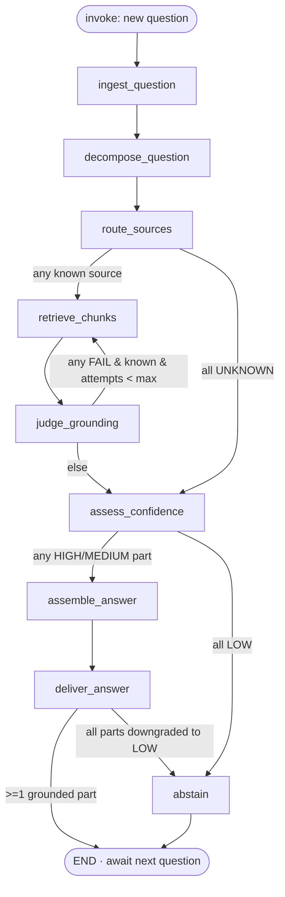

# BUILD SPEC — Floor-Supervisor Documentation Q&A (grounded RAG)

> Copy target: `docs/SPEC.md`. CC reads this alongside `CLAUDE.md`. §3 (state schema) is built and
> confirmed FIRST; everything else builds against it. LLM nodes are pass-through stubs in this
> orchestration pass; deterministic decision/routing/confidence/delivery logic is built REAL now.
> Agent internals are specified separately in `AGENTS-SPEC.md`.

## 1. Problem & KPI
- **Problem (one sentence):** A floor supervisor asks a multi-part question and gets a single, correct, **cited** answer drawn only from the right plant documentation (safety procedures, maintenance manuals, or quality-control standards) — answering the parts it can ground, and **clearly stating where it is unsure rather than guessing.**
- **Primary KPI:** **% straight-through** = fully grounded, cited answers delivered at HIGH confidence with no uncertainty flag. **Counterweight:** **groundedness/honesty** — zero ungrounded claims ever delivered, and every low-confidence part is explicitly flagged, never fabricated.
- **Secondary metrics:** answer cycle time, partial-answer rate, abstain rate, judge-reject rate, knowledge-gap count.
- **Users:** internal (floor supervisors) · **Agent authority:** **informs / answers only.** It never actuates equipment or issues procedures; it answers with citations + confidence, and **honestly abstains** on anything it can't ground. No human-in-the-loop gate — uncertainty is surfaced to the supervisor directly.

## 2. Agency line
| Step | LLM / Deterministic / Hybrid | Why |
|---|---|---|
| Decompose multi-part question into sub-questions + propose a source per sub-question | **LLM** | Unstructured parsing/classification of free-text supervisor input. |
| Validate proposed source against the known-source enum; set retrieval filter | **Deterministic** | Routing to a system of record must be auditable; an unknown source is never silently invented. |
| Hybrid retrieve (dense + BM25) top-k chunks per sub-question | **Deterministic** (tool; embedder/store mocked this pass) | Search is mechanical and must be reproducible; the index is the source of truth. |
| Judge chunks for relevance + groundedness; **verify a requested table value is actually present** | **LLM (judge)** | Reading-comprehension judgment over text/tables. Returns a structured verdict; routing on it is deterministic. |
| **Decide confidence (HIGH / MEDIUM / LOW) and whether to answer, caveat, or abstain** | **Deterministic** | A model's self-reported confidence is unreliable in both directions. The decision to stand behind or abstain on an answer must be defensible — computed from signals the LLM can't fake (retrieval score, judge verdict, citation coverage). |
| Assemble a cohesive, cited answer from HIGH/MEDIUM parts only | **LLM** | NL generation grounded in supplied chunks. **Never invoked on LOW parts.** |
| Enforce ≥1 citation per delivered part; stitch deterministic uncertainty statements for LOW parts | **Deterministic** | The grounding + honesty guarantees are hard controls, never left to the model. |

**One-liner:** *AI reads the question, judges the evidence, and drafts the grounded parts · deterministic code routes to known sources, enforces citations, decides confidence, and abstains honestly on anything it can't ground — it never guesses.*

## 3. State schema (BUILD & VALIDATE FIRST — confirm before proceeding)

Single canonical Pydantic v2 object. `state.py` imports nothing and is imported everywhere. **`thread_id == conversation_id`** (one per supervisor conversation) — conversation memory is the checkpointer keyed by `thread_id`; the graph processes **one turn (one question) per invocation**, the conversation loop is repeated invocation on the same thread. There are **no interrupts** — the checkpointer is purely for conversation memory + replay.

### Enums (no free-text status)
- `DocSource`: `SAFETY_PROCEDURES` · `MAINTENANCE_MANUALS` · `QUALITY_CONTROL` · `UNKNOWN`
- `ElementType`: `PROSE` · `TABLE` · `FIGURE`
- `TurnStatus`: `RECEIVED` → `DECOMPOSED` → `ROUTED` → `RETRIEVED` → `JUDGED` → `ASSESSED` → `ASSEMBLED` → `ANSWERED`; plus `ANSWERED_PARTIAL` · `ABSTAINED` · `FAILED`
- `ConversationStatus`: `ACTIVE` · `ENDED`
- `JudgeVerdict`: `PASS` · `FAIL`
- `ConfidenceLevel`: `HIGH` · `MEDIUM` · `LOW`
- `Role`: `SUPERVISOR` · `ASSISTANT`
- `GapReason`: `NO_SOURCE_MATCHED` · `LOW_RETRIEVAL` · `JUDGE_FAIL_AT_CAP` · `VALUE_NOT_FOUND`

### Typed sub-objects
- `RetrievedChunk`: `{ chunk_id: str, source: DocSource, doc_title: str, doc_version: str, section: str, page: int | None, element_type: ElementType, text: str, table_markdown: str | None, figure_ref: str | None, score: float }`
  - `text` = the **embedded representation**. For `TABLE`, `table_markdown` carries the **full original table** (returned to the assembler verbatim). For `FIGURE`, `figure_ref` is the citable reference (e.g. "Figure 4-2") and `text` is its caption + OCR'd labels + ingest-time description.
- `Citation`: `{ chunk_id: str, source: DocSource, doc_title: str, doc_version: str, section: str, page: int | None, element_type: ElementType, figure_ref: str | None, snippet: str }`
- `SubQuestion`: `{ id: str, text: str, proposed_source: DocSource, routed_source: DocSource, retrieved: list[RetrievedChunk] = [], retrieval_attempts: int = 0, judge_verdict: JudgeVerdict | None, judge_reasons: list[str] = [], confidence: ConfidenceLevel | None }`
- `KnowledgeGap`: `{ ts: datetime, turn_id: str, sub_question_id: str, question_text: str, attempted_source: DocSource, reason: GapReason, top_score: float | None }`
- `Turn`: `{ turn_id: str, role: Role, question_text: str, sub_questions: list[SubQuestion] = [], answer_text: str | None, citations: list[Citation] = [], turn_confidence: ConfidenceLevel | None, status: TurnStatus, ts: datetime }`
- `Event` (per OBSERVABILITY.md): `{ thread_id, node, ts, status, model, tokens_in, tokens_out, latency_ms, retries, cost_usd, summary, state_delta, error? }`
- `AuditEntry`: `{ ts: datetime, actor: str, action: str, before: dict, after: dict, detail: str }`
- `Metrics` (rollup): `{ cycle_time: float, stage_dwell: dict[str,float], tokens_total: int, cost_total: float, cost_by_agent: dict[str,float], retries: int, judge_reject_rate: float, straight_through_pct: float, partial_rate: float, abstain_rate: float, knowledge_gap_count: int }`

### Canonical object — `ConversationState`
```
conversation_id: str            # == thread_id
supervisor_id: str
status: ConversationStatus = ACTIVE
turns: list[Turn] = []          # full history = conversation memory
current_turn: Turn | None       # the turn being processed this invocation
knowledge_gaps: list[KnowledgeGap] = []   # append-only telemetry (non-blocking)
config: { top_k: int = 5, max_retrieval_loops: int = 2,
          high_score_floor: float = 0.75, min_score_floor: float = 0.45 }
audit_log: list[AuditEntry] = []
events: list[Event] = []
metrics: Metrics
```
**Validate with a round-trip parse (`ConversationState(**ConversationState(...).model_dump())`) before building anything on top of it.** This is the freeze point.

## 4. Agents (frozen contracts — the parallelization unlock)
Agency level = build-now state for THIS pass. Tier = task-type only (CC proposes concrete model IDs in the agents pass, per `MODELS.md`).

| Agent / node | Role / boundary | Agency (this pass) | In → Out (typed) | Tools | Guardrails | Failure handling | Tier |
|---|---|---|---|---|---|---|---|
| `ingest_question` | Open/append a turn for the new question | **deterministic-real** | `(state, question_text)` → `current_turn(RECEIVED)`, appended to `turns` | — | reject empty/oversized input → FAILED | — |
| `decompose_question` | Split multi-part question into sub-questions; propose a source per sub-q | **LLM-stub** | `current_turn.question_text` → `sub_questions[]` with `proposed_source`, status `DECOMPOSED` | — | malformed output → single sub-q, `proposed_source=UNKNOWN` | cheap |
| `route_sources` | Validate each `proposed_source` vs `DocSource`; set `routed_source` + filter | **deterministic-real** | `sub_questions[].proposed_source` → `routed_source`, status `ROUTED` | — | any `UNKNOWN` → skip retrieval, flagged for LOW + gap | — |
| `retrieve_chunks` | Hybrid (dense+BM25) top-k search per known-source sub-q; increment attempts | **deterministic-real** (embedder/store mocked) | `sub_questions[].text, routed_source` → `retrieved[]`, `retrieval_attempts++`, status `RETRIEVED` | `hybrid_search` | empty index / embed error → empty `retrieved` + error event (not a crash) | cheap (embed) |
| `judge_grounding` | Per sub-q, verdict on relevance + groundedness; **for TABLE chunks, verify the requested value is unambiguously present** | **LLM-stub** (judge) | `sub_questions[].text, retrieved[]` → `judge_verdict, judge_reasons`, status `JUDGED` | — | parse failure → `FAIL` (fail-closed); value-not-present → `FAIL` | capable |
| `assess_confidence` | Compute `ConfidenceLevel` per sub-q from retrieval score + judge verdict + citation coverage; set `turn_confidence = min`; record gaps | **deterministic-real** | sub-q signals → `confidence`, `turn_confidence`, `knowledge_gaps[]`, status `ASSESSED` | — | missing signal → conservative `LOW` | — |
| `assemble_answer` | Compose cited answer fragments for **HIGH/MEDIUM parts only** | **LLM-stub** | passed `sub_questions[] + retrieved[]` → `answer_text` fragments, `citations[]`, status `ASSEMBLED` | — | never invoked on LOW parts; empty draft → 0 citations (caught at delivery) | mid |
| `deliver_answer` | Enforce ≥1 citation per HIGH/MEDIUM fragment; stitch deterministic uncertainty lines for LOW parts; set turn status + confidence | **deterministic-real** | fragments + `citations[]` → final `answer_text`, status `ANSWERED`/`ANSWERED_PARTIAL` | — | fragment with 0 citations → downgrade to LOW; if all LOW → `abstain` | — |
| `abstain` | Emit fully deterministic "no grounded documentation; consult …" message; never fabricates | **deterministic-real** | `current_turn` → `answer_text`(safe), status `ABSTAINED` | — | always succeeds | — |

### 4b. Tool contracts (freeze with the schema)
| Tool | Input (typed) | Output (typed) | Error surface | Mock or real |
|---|---|---|---|---|
| `hybrid_search` | `{ query_text: str, source: DocSource, top_k: int }` | `list[RetrievedChunk]` (dense+BM25 fused via RRF, scored, source-filtered) | `EMPTY_INDEX` · `EMBED_ERROR` → returns `[]` + flag | **mock** — in-memory dense index (mock embeddings) + BM25 index over `mock_data/` corpus (prod: managed hybrid search) |
| `prompt_cache_get` | `{ key: str }` (key = `sha256(normalized_subq + routed_source)`) | `CachedResult \| None` | miss → `None` | **mock** — in-memory dict (prod: Redis) |
| `prompt_cache_set` | `{ key: str, value: CachedResult, ttl_s: int }` | `bool` | write error → `False` (non-fatal) | **mock** — in-memory dict (prod: Redis) |

> Prompt cache is a **deterministic optimization wrapper around `retrieve_chunks`/`assemble_answer`**, not a graph node. Local mock = in-memory dict; production = Redis. A cache hit **re-enters the same judge + confidence + citation gates** — it must never change a verdict or bypass grounding.

## 5. Retrieval & chunking strategy
Manuals/QC docs carry **tables and diagrams**; naive token-window chunking splits a spec value from its header and produces a confidently-wrong answer. The grounding guarantee depends on element-aware handling.

**Parsing — element-aware, not size-aware.** Parse each doc into structural elements (heading / prose / table / figure) first, then chunk along element boundaries. Tables and figures are never split mid-element. *Production:* a document-parsing service (Textract / Azure Document Intelligence / Docling). *Demo:* **mocked** — the synthetic corpus is authored already-chunked with `element_type` tags via the `synthetic-data` subagent; we demonstrate the handling without building a real PDF parser.

**Tables — atomic chunk + dual representation + judge-verifies-the-value.** Each table is **one chunk** (`element_type=TABLE`). The **embedded** text is a NL summary/caption (so semantic search finds it); the **returned** payload is `table_markdown` (the full original table, verbatim, so the answer is exact). Oversized tables chunk by row-groups with the **header repeated in every chunk**. The `judge_grounding` step must confirm the **specific value the sub-question asks for is unambiguously present** in `table_markdown`; if not, it returns `FAIL` → the part goes `LOW` (`VALUE_NOT_FOUND`). **The value is never interpolated or inferred.**

**Figures — text-only (no runtime vision).** At **ingest** (offline/build-time, mocked in the synthetic corpus), each figure becomes text: caption + OCR'd labels + a one-time description. That text is embedded; retrieval returns `figure_ref` + the text. The answer **cites the figure** ("see Figure 4-2, Maintenance Manual §4.3") and may quote its labels, but never describes a diagram it didn't parse. **No vision model runs at query time.**

**Retrieval — hybrid (dense + BM25).** Plant queries are full of exact identifiers (part numbers, valve tags, error codes, spec designations like "M12-A307") that dense search retrieves poorly. `hybrid_search` runs dense + sparse/BM25 and fuses via **Reciprocal Rank Fusion**, source-filtered, top-k with a `min_score_floor`. (Optional re-ranker after fusion = stretch.) Chunks below `min_score_floor` are treated as no usable evidence → `LOW`.

**`doc_version` is load-bearing:** mixing an old and new torque spec is a grounding failure even though "docs change rarely." Every chunk/citation carries `doc_version`; the corpus includes ≥2 versions of one doc to exercise it.

## 6. Orchestration

**Topology:** single-conversation orchestrator over a fixed node pipeline with bounded retrieval retries and a deterministic confidence gate. Sub-questions are processed as a batch inside each node; conditional edges fire on aggregate predicates over `current_turn.sub_questions`. **No interrupts.**



**Confidence mapping (deterministic, in `assess_confidence`):** per sub-question, from signals the LLM can't fake —
- **HIGH** — judge `PASS` + top fused score ≥ `high_score_floor` + full citation coverage.
- **MEDIUM** — judge `PASS` but weak/partial evidence (top score between floors, or partial coverage) → answer **with an explicit "verify against §X" caveat**.
- **LOW** — judge `FAIL` (incl. `VALUE_NOT_FOUND`), or no chunk ≥ `min_score_floor`, or `routed_source == UNKNOWN` → **abstain on that part**; the LLM assembler is never invoked on it.
- **`turn_confidence = min` across sub-questions** — a multi-part answer is only as trustworthy as its weakest part.
- Every `LOW` (and `UNKNOWN`-source) part is recorded to `knowledge_gaps` with its `GapReason`.

**Routing (deterministic conditional edges):**
- `route_sources`: `any(routed_source != UNKNOWN)` → `retrieve_chunks`; `all UNKNOWN` → `assess_confidence`.
- `judge_grounding`: `any(FAIL & routed_source != UNKNOWN & attempts < max_retrieval_loops)` → `retrieve_chunks` (re-retrieve only those); else → `assess_confidence`.
- `assess_confidence`: `any(confidence in {HIGH,MEDIUM})` → `assemble_answer`; else (all `LOW`) → `abstain`.
- `deliver_answer`: ≥1 grounded part survives citation enforcement → `END`; all parts downgraded to `LOW` → `abstain`.

**Named routing-invariant tests** (each asserted offline with forced stubs):
1. `test_never_answer_ungrounded` — a `FAIL`/`LOW` part never appears as a confident cited claim; it becomes an explicit uncertainty line or abstain.
2. `test_always_cite` — every HIGH/MEDIUM fragment delivered carries ≥1 citation; a fragment that loses its citation is downgraded to LOW, never delivered as fact.
3. `test_never_guess` — LOW/UNKNOWN parts produce a **deterministic** uncertainty statement; `assemble_answer` is never invoked on them; no fabricated content or citation.
4. `test_route_only_known_sources` — a sub-q with `routed_source == UNKNOWN` never reaches `hybrid_search`; auto-LOW + gap logged.
5. `test_max_retrieval_loops` — retrieval retries are bounded by `max_retrieval_loops`; at cap the part goes LOW (no infinite loop).
6. `test_confidence_is_min` — `turn_confidence == min(sub-question confidences)`.
7. `test_grounded_happy_path` — all HIGH → `ANSWERED`, fully cited.
8. `test_partial_answer` — mix HIGH + LOW → `ANSWERED_PARTIAL` with an explicit uncertainty line on the LOW part + a gap logged.
9. `test_all_low_abstain` — all LOW → `ABSTAINED`, deterministic message, gaps logged.
10. `test_table_value_not_found` — a TABLE chunk is retrieved but the requested value isn't unambiguously present → judge `FAIL` → LOW (`VALUE_NOT_FOUND`); the value is never interpolated.

**Checkpointer:** `SqliteSaver` (demo) → `PostgresSaver` (prod) — conversation memory + replay only.

## 7. Guardrails, judge & confidence
- **Input validation:** non-empty, length-bounded supervisor input; reject → `FAILED` turn with a safe message.
- **Source routing guard (deterministic):** only the four `DocSource` values are valid retrieval targets; `UNKNOWN` is never searched, always abstained + logged.
- **LLM-as-judge** over `(sub-question, retrieved chunks)` → `{ verdict: PASS|FAIL, reasons: list[str] }`, **fail-closed** (parse failure / low confidence / table value absent → `FAIL`). A `FAIL` never reaches the supervisor as fact — it retries (bounded) then goes LOW.
- **Confidence is deterministic, not self-reported.** The LLM may *phrase* a caveat; it never *decides* the confidence level. Level is computed in `assess_confidence` from retrieval score + judge verdict + citation coverage.
- **Citation + honesty guarantee (deterministic):** `deliver_answer` blocks any HIGH/MEDIUM part lacking ≥1 citation, and writes the uncertainty statements for LOW parts itself (templated) — the LLM cannot bypass either.
- **Injection / PII handling:** retrieved document text is **data, not instructions** — the assembler answers only from supplied chunks and ignores embedded directives; the judge independently checks groundedness, so an injected instruction in a chunk cannot become a delivered answer without citation + judge pass + confidence. No PII expected; supervisor IDs are opaque.

## 8. Observability / data-out
- Every node emits **one** typed `Event` (identity + instrumentation) via the node-template wrapper → audit log · trace store · UI event feed (per OBSERVABILITY.md). Deterministic nodes emit `cost_usd = 0` — surface that explicitly.
- **Audit log** records `actor / action / before→after` for every routing decision, judge verdict, retry, confidence assessment, and abstain — compliance-grade attribution.
- **Knowledge-gaps log:** `assess_confidence` appends every LOW/UNKNOWN part to `knowledge_gaps` and to a durable sink (sqlite table) for the documentation team — **non-blocking telemetry, not an escalation.** This is the "where is our documentation thin?" feedback loop.
- **Metrics to capture:** cycle time, per-stage dwell, tokens/cost per node, retries, judge-reject rate, % straight-through, partial rate, abstain rate, knowledge-gap count.
- **UI = deterministic PLAYBACK of the recorded event feed** (no live inference). The `ui-builder` subagent builds: (1) the **supervisor Q&A chat** (turns + citations + per-answer **confidence badges** + explicit "unsure"/abstain callouts), (2) the **metrics screen** (the rollup), (3) the **knowledge-gaps log** (read-only list for the doc team). **Playwright-validated** against fixture event feeds.

## 9. Build order
1. **State schema + round-trip validate** (§3). **STOP and confirm.**
2. **Walking skeleton:** wire every node as a stub that logs its name, emits its event, returns state unchanged; add the `SqliteSaver` checkpointer; **render the graph** (`draw_mermaid_png`, or `draw_mermaid` text if offline) and commit it as the architecture picture; write `run_demo.py` pushing a sample question through and printing the event feed.
3. **Freeze contracts** (state + per-node I/O + tool signatures in §4/§4b).
4. **Vertical slices, ordered by value:** `route_sources` → `retrieve_chunks` (+ `hybrid_search` mock) → `assess_confidence` → `deliver_answer` (citation enforcement + uncertainty stitching) → `abstain`. (LLM nodes stay stubs here; made real in `AGENTS-SPEC.md`.)
5. **Cross-cutting baked into the node template once:** event emit · audit append · try/except→safe-degrade · tracing span · knowledge-gap sink.
6. **Stretch:** the three UI screens (playback) · the Redis-mock prompt cache wrapper · optional re-ranker.

## 10. Mock data
- **Needed:** a small synthetic corpus across the three sources, **including all three element types** — prose chunks, `TABLE` chunks (NL summary embedded + `table_markdown` full), and `FIGURE` chunks (caption+labels text + `figure_ref`); ≥2 `doc_version`s of one doc. Golden supervisor questions covering: single-source HIGH; multi-part cross-source; a **table-value** question with the value present (HIGH) and a variant with it absent (LOW `VALUE_NOT_FOUND`); a **figure-reference** question; an **exact-identifier** question (part/tag number — exercises BM25/hybrid); an **unanswerable/no-source** question (UNKNOWN → abstain); an **off-topic-retrieval** question (judge FAIL → retry → LOW).
- Generate via the **`synthetic-data` subagent**; **confirm before feeding into the system**; note contents in `RESULTS.md`.

## 11. Orchestration tests (OFFLINE — no LLM / no API key)
Each test supplies an input fixture + **forced stub outputs** for the LLM nodes and asserts routing/invariant:
- **happy path** — 2 sub-qs, known sources, stub judge PASS×2, score above `high_score_floor` → assemble → `ANSWERED`, fully cited.
- **retry branch** — stub judge FAIL (attempts<max) then PASS on re-retrieve → asserts `retrieval_attempts` incremented.
- **max-loop → LOW** — stub judge FAIL persistently → at cap → LOW → (if sole part) `ABSTAINED`; gap `JUDGE_FAIL_AT_CAP`.
- **unknown-source → abstain** — stub decompose yields `proposed_source=UNKNOWN`; never retrieves; LOW; gap `NO_SOURCE_MATCHED`; `ABSTAINED`.
- **partial answer** — one sub-q HIGH, one LOW → `ANSWERED_PARTIAL`; LOW part rendered as a deterministic uncertainty line; `turn_confidence == LOW`.
- **ungrounded-at-delivery** — force assembler stub to emit a fragment with **0 citations** → `deliver_answer` downgrades it to LOW (never delivered as fact).
- **table value-not-found** — TABLE chunk retrieved, stub judge returns FAIL(`value absent`) → LOW `VALUE_NOT_FOUND`; value never interpolated.
- **all-low abstain** — all parts LOW → `ABSTAINED`, deterministic message, gaps logged.
- **conversation memory** — two turns on one `thread_id`; assert turn 2's state includes turn 1 in `turns` (checkpointer round-trip).

## 12. Autonomy block (for CC)
Build the **state schema**, then the **walking skeleton**, then **render the architecture** (commit the mermaid). **STOP ONCE** here for human approval of the state schema + skeleton. After approval, **run to completion with no further confirmation gates**: build the deterministic vertical slices, bake in cross-cutting, build the UI playback, and make all §11 tests + §6 named invariant tests green. **If anything cannot be made green, STOP and report it — never fake a pass, never fabricate output, never paper over a red test.**

## 13. Definition of done
- §3 schema validates (round-trip) and is confirmed.
- Graph renders; `run_demo.py` prints a coherent event feed for a sample question.
- All §11 orchestration tests + §6 named routing-invariant tests pass **offline, with no API key**.
- The three UI screens render and pass Playwright validation against fixture feeds.
- `RESULTS.md` written with **REAL** captured test output (paste the actual pytest run), the architecture render reference, the decisions made at the suspended gate (state-schema approval), and any defaults applied. Evidence, not claims. If any item is red, `RESULTS.md` states exactly what and why — no green-washing.

---

## Production mapping (REFERENCE ONLY — DO NOT BUILD)
> Local only. For narration and the slide, never for building.

| Concern | Local (build this) | AWS | Azure |
|---|---|---|---|
| Agent runtime | local process | Bedrock AgentCore Runtime | Foundry Agent Service |
| State / checkpoint | `SqliteSaver` | AgentCore Memory / DynamoDB | Foundry memory / Cosmos DB |
| Document parsing | mocked (pre-chunked corpus) | Textract | Azure Document Intelligence |
| Vector + keyword (hybrid) | in-memory dense + BM25 mock | Bedrock Knowledge Bases / OpenSearch hybrid | Azure AI Search (hybrid) |
| Re-ranker (stretch) | optional local | Bedrock / Cohere Rerank | Azure AI Search semantic ranker |
| Prompt cache | in-memory dict | ElastiCache (Redis) | Azure Cache for Redis |
| Tools | mocked interfaces | AgentCore Gateway (MCP) | Foundry tools / MCP connectors |
| Observability | console + sqlite | CloudWatch GenAI / OTel | Foundry observability |
| Guardrails (judge + citation + confidence) | in-process | Bedrock Guardrails | Foundry content safety / XPIA |
